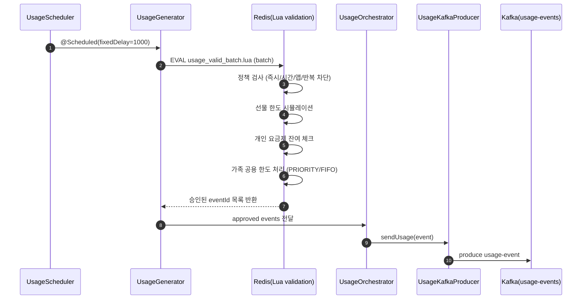
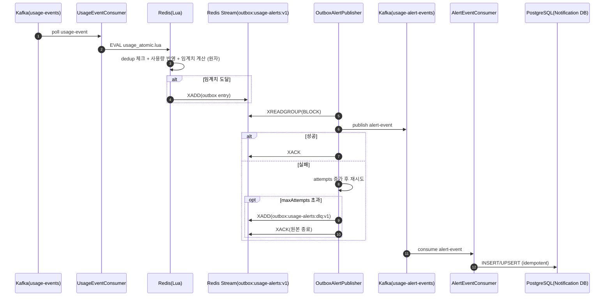
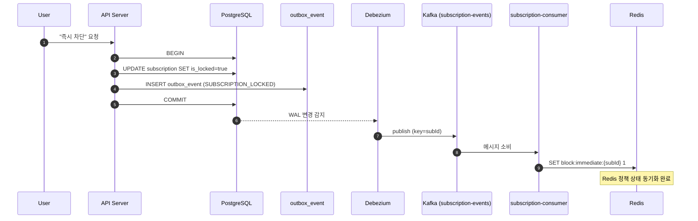
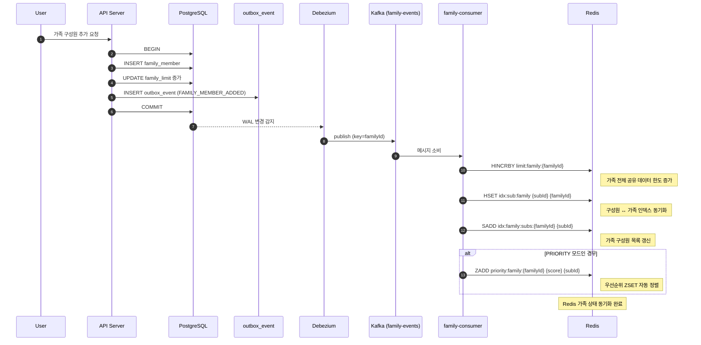
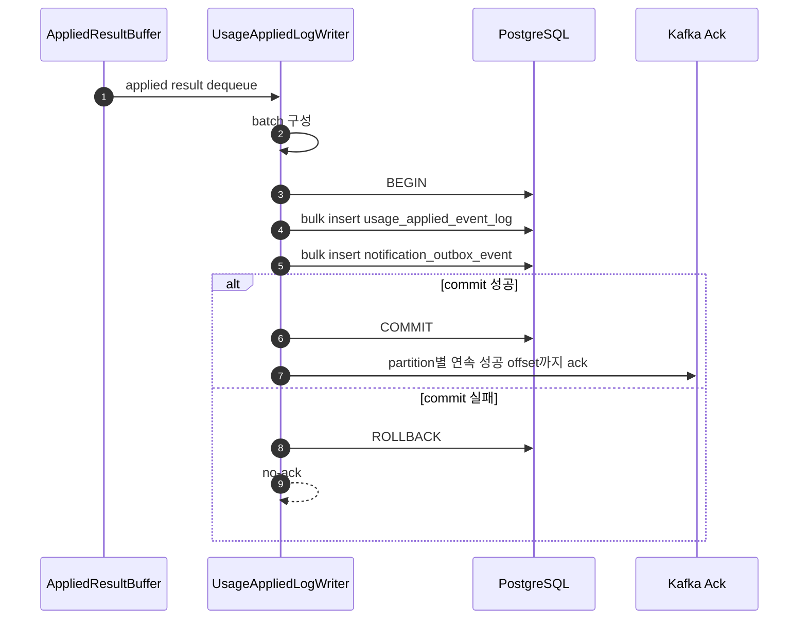
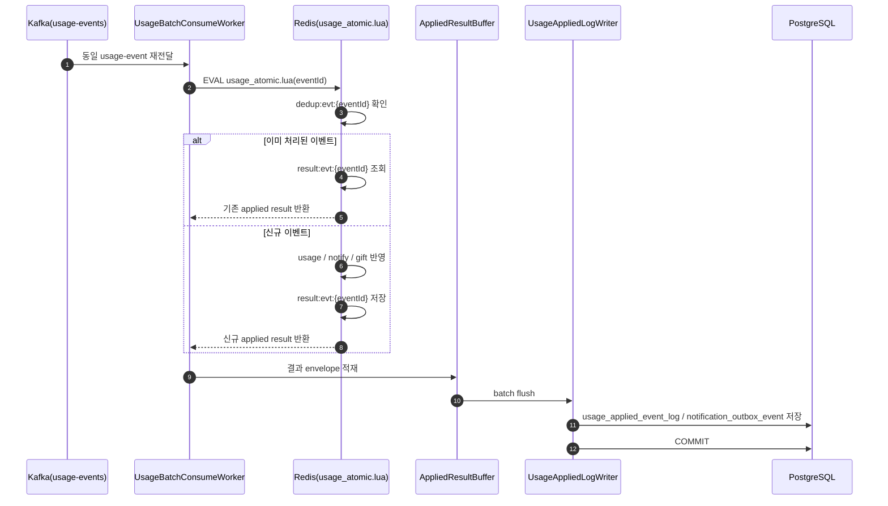
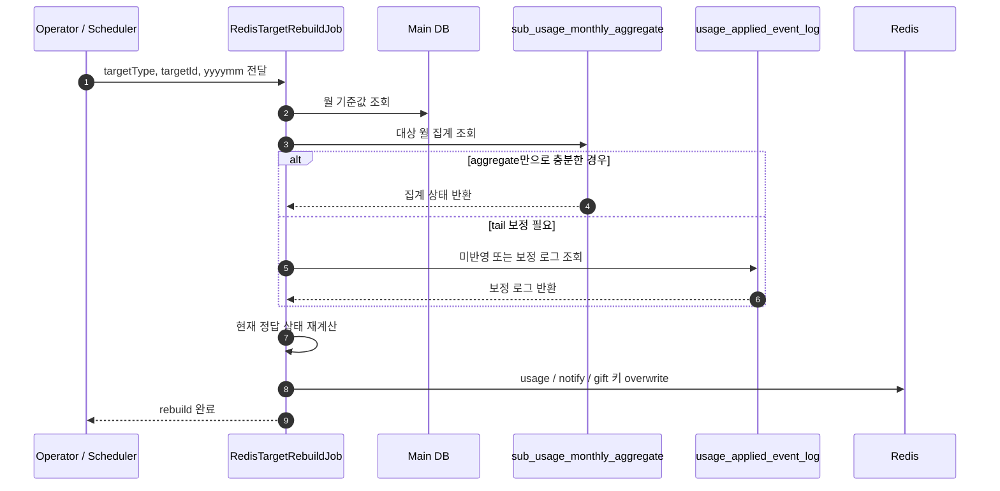

<h1 align="center">HotSpot 🔥</h1>
<p align="center">
  <b>공유는 여기서, 차단은 저기서? NO!!</b>
</p>
<p align="center"><b>가족 데이터 공유 + 사용 제어, 흩어진 기능을 하나의 통합 서비스로</b></p>
<p align="center"><b>디지털 페어런팅의 시작, HotSpot</b></p>

</br>

---
</br>

## 📝 Overview
**HotSpot Worker**는 Kafka 기반의 **실시간 사용량 집계 파이프라인**을 담당합니다.

단순히 사용량만 누적하는 것이 아니라, 이벤트 한 건을 처리할 때 다음을 함께 다룹니다.

- 중복 이벤트 방지
- 선물 / 개인 / 가족 데이터 차감
- 월 / 일 / 앱별 사용량 반영
- 임계치(50 / 30 / 10 / 소진) 판정
- 중복 알림 방지
- 알림 Outbox 생성
- 장애 대비를 위한 DB 로그 적재

이를 위해 HotSpot Worker는 **두 단계 Lua 구조**를 사용합니다.

- **Producer 단계**: `usage_valid_batch.lua`
  - 정책과 한도를 미리 검증해 **유효한 이벤트만 Kafka에 적재**
- **Consumer 단계**: `usage_atomic.lua`
  - 사용량 반영, 임계치 계산, 결과 캐시 저장을 **원자적으로 처리**

또한 Redis만으로 끝내지 않고, 처리 결과를 비동기 Writer가 PostgreSQL에 적재하여  
**durable log + 월 집계 + Redis 복구 기반**까지 확보한 구조입니다.

</br>

## 📌 목차
[🚀 HotSpot Worker: 사용량 이벤트 발행 (Producer)](#producer)
  - [🗺️ 개요](#producer-overview)
  - [🔎 데이터 흐름](#producer-flow)

[🚚 HotSpot Worker: 사용량 집계 & 알림 파이프라인](#pipeline)
  - [🗺️ 개요](#pipeline-overview)
  - [🔎 데이터 흐름](#pipeline-flow)

[🔄 RDB ↔ Redis 정합성 보장: CDC (Debezium + Outbox)](#cdc)
  - [🗺️ 개요](#cdc-overview)
  - [🔎 동작 흐름](#cdc-flow)

[🛡️ Redis 고가용성 보장: Sentinel 기반 Failover](#redis-ha)
  - [🗺️ 개요](#redis-ha-overview)
  - [🔎 구조와 장애 조치 흐름](#redis-ha-flow)
  - [🧪 로컬 검증 결과](#redis-ha-test)

[🔁 Redis-only의 한계와 RDB 기반 정합성 아키텍처 전환](#evolution)
  - [⚠️ Redis-only의 구조적 한계](#evolution-limit)
  - [🎯 목표](#evolution-goal)
  - [🔎 데이터 흐름](#evolution-path)


</br>

---
</br>

<a id="producer"></a>
## 🚀 HotSpot Worker: 사용량 이벤트 발행 (Producer)

실시간 사용량 집계 파이프라인은 **usage-events가 Kafka에 적재되는 시점**부터 시작됩니다.

하지만 이 이벤트는 **단순히 랜덤으로 발행되는 것이 아니라, 정책 검증과 한도 시뮬레이션을 통과한 이벤트만 발행되도록 설계**되어 있습니다.

</br>

<a id="producer-overview"></a>
## 🗺️ 개요

### 1) 문제
실시간 이벤트 환경에서는 **정책과 한도**가 고정되어 있지 않습니다.
- **부모가 앱 차단을 설정하는 순간**
- **가족 공용 데이터 한도를 변경하는 순간**
- **선물 데이터가 추가/회수되는 순간**

이 모든 변경은 **이벤트 생성 시점과 처리 시점 사이**에 발생할 수 있습니다.

특히 다음과 같은 문제가 존재합니다.
- Producer에서 정책/한도 검증 없이 무조건 Kafka에 적재할 경우
→ 불필요한 이벤트가 대량으로 Consumer까지 전달됨

- Producer에서 검증했더라도, Kafka 적재 이후 정책/한도가 변경될 경우
→ Consumer가 이를 재검증하지 않을 경우 잘못된 사용 반영 발생

즉, **이벤트 생성 시점과 상태 반영 시점 사이의 시간차**가 정합성 리스크의 근본 원인입니다.

### 2) 해결
HotSpot은 이를 다음과 같이 설계했습니다.

**(1) 1차 방어: Producer 단계 정책/한도 검증**
- Redis Lua로 정책/차단/한도 시뮬레이션 수행
- 사용 불가 이벤트는 Kafka에 적재하지 않음
- 불필요한 이벤트를 사전에 차단하여 스트림 정제
- Kafka 부하 감소 및 다운스트림 오염 방지

Producer는 **정책 게이트 역할**을 수행합니다.


**(2) 2차 방어: Consumer 단계 원자적 재검증**
Consumer에서는 usage_atomic.lua를 통해
- dedup 체크
- 실제 사용량 반영
- 임계치 계산
- 알림 Outbox 적재

이 모든 과정을 **Redis Lua 원자 연산**으로 처리하여 
**정책/한도 변경이 Producer 이후 발생하더라도 Consumer에서 실제 반영 시점의 최신 상태 기준으로 처리**

</br>

<a id="producer-flow"></a>
## 🔎 데이터 흐름: Scheduler → Redis Lua 검증 → Kafka usage-events 발행


### 흐름 상세

#### Step 0. Scheduler 기반 이벤트 생성
- @Scheduled(fixedDelay=1000)로 1초마다 이벤트 생성
- Redis에 등록된 가족/구성원(subId)을 기준으로 랜덤 사용량 생성
- 대량 이벤트 상황(부하/스트리밍 환경)을 가정한 구조

</br>

#### Step 1. Redis Lua 기반 배치 정책 검증

데이터 사용량 이벤트를 생성하여 Kafka로 바로 보내지 않습니다.
Redis Lua Script를 활용하여 "이 사용자가 현재 데이터를 쓸 수 있는 사용자인지"를 먼저 검증한 후 이를 통과한 사용자들에 대해서만 Kafka로 이벤트를 발행합니다.

- **정책 차단 검사**
	•	즉시 차단 (block:immediate)
	•	시간 차단 (block:time)
	•	앱 차단 (block:app)
	•	반복 차단 (block:repeat)

- **선물 데이터 소진 시뮬레이션**
	•	idx:gift:* 정렬 기준으로 선물 순서 보장
	•	남은 gift_limit 계산
	•	메모리 캐시 기반 차감 시뮬레이션

- **개인 요금제 데이터 잔여 체크**
	•	limit:sub
	•	usage:sub:{yyyyMM}
	•	남은 개인 한도 계산

- **가족 공용 데이터 한도 처리**
	•	priority:family:{familyId} 존재 여부에 따라 **우선순위 처리 모드 OR 선착순 모드**
	•	가족 전체 한도 + 가족 공용 데이터 구성원 개별 한도 동시 체크

</br>

#### Step 2. 승인된 이벤트만 Kafka로 발행
- Redis Lua가 반환한 **승인된 eventId만 필터링하여 Kafka usage-events Topic**에 적재합니다.
- **정책 검증 위반 이벤트나 잔여 한도 초과 이벤트**는 Topic에 적재되지 않습니다.

</br>

---

</br>

<a id="pipeline"></a>
## 🚚 HotSpot Worker: 사용량 집계 & 알림 파이프라인

Spring Boot + Kafka + Redis + PostgreSQL 기반의 **실시간 데이터 사용량 집계 및 임계치 알림 파이프라인**입니다.  
핵심은 이벤트를 소비할 때 **Redis Lua로 사용량 반영 + 임계치 계산 + 알림 Outbox 적재를 원자적으로 처리**하고, 
별도 Publisher가 Outbox를 읽어 **Kafka로 발행**한 뒤 알림 서비스를 통해 **Notification DB(PostgreSQL)** 에 적재하는 구조입니다.

</br>

<a id="pipeline-overview"></a>
## 🗺️ 개요

### 1) 문제
실시간 이벤트 처리에서는 다음 문제가 자주 발생합니다.

- 사용량 반영과 알림 생성이 분리되면 **불일치**가 발생(알림 누락/중복)
- Kafka 발행, DB 적재는 네트워크/브로커/DB 장애로 실패 가능
- 장애가 나도 운영자가 지금 어디가 막혔는지 즉시 판단해야 함

### 2) 해결
- `usage-events` 소비 시 **Redis Lua**로 다음을 **단일 원자 연산**으로 처리합니다.
  - dedup(중복 이벤트 방지)
  - 사용량 상태 반영
  - 임계치 계산
  - 알림 발생 시 Outbox Stream 적재
- `OutboxAlertPublisher`가 Outbox를 **Redis Stream consumer group**으로 읽어 **Kafka `usage-alert-events`** 발행
- 발행 성공 시 `XACK`, 실패 시 attempts 메타 증가 → `maxAttempts` 초과 시 **DLQ**로 격리
- 알림 컨슈머가 `usage-alert-events`를 소비하여 **Notification DB(PostgreSQL)** 적재

</br>

--- 
</br>

<a id="pipeline-flow"></a>
## 🔎 데이터 흐름: usage-events → Redis Lua → Outbox → Kafka → Notification DB



</br>

이 파이프라인은 **사용량 반영(상태 변경)** 과 **알림 발생(이벤트 생성)** 을 분리하지 않고, **Redis Lua로 원자적으로** 처리하는 것이 핵심입니다.  
그 다음 단계(Outbox → Kafka → DB)는 **외부 장애가 자주 나는 구간**이라 Outbox 기반으로 **재시도/복구 가능**하게 설계했습니다.

</br>

### 1) 이벤트 처리 단위와 정합성 기준

- 입력 이벤트(usage-events)는 `eventId`를 포함한다고 가정하며, 이 값은 **멱등의 기준**이 됩니다.
- 동일 이벤트가 Kafka에서 재전달되거나(리밸런스/재시작) 컨슈머가 재처리해도,
  `dedup:usage-event:{eventId}`를 통해 **사용량이 두 번 반영되지 않도록** 보장합니다.
- 사용량 상태와 알림 생성은 같은 시점의 결과여야 하므로, Lua에서 **상태 업데이트 + 임계치 판정 + Outbox 적재**를 **하나의 트랜잭션(원자 연산)** 처럼 실행합니다.

</br>

### 2) 흐름 상세

#### Step 0. Kafka에서 usage-events 소비
- UsageConsumer가 사용량 이벤트를 소비합니다.

</br>

#### Step 1. Redis Lua 실행 (원자 처리)
Kafka에서 받은 이벤트를 Lua로 전달해 다음을 한 번에 처리합니다.

(1) **Dedup 체크**
- `dedup:usage-event:{eventId}`가 이미 있으면 **바로 종료(dedup_hit)**  
- 없으면 set + TTL 설정 후 다음 단계 진행

(2) **사용량 반영**
- `usage:*` 키에 사용자/가족 사용량을 반영하고 잔여량을 갱신합니다.
- 이 업데이트가 “정답”이 되므로 반드시 원자적으로 수행되어야 합니다.

(3) **임계치 계산**
- 갱신된 잔여량/소진률을 기준으로 50/30/10/0 같은 임계치를 판정합니다.
- 여기서 `notify:*` 상태를 활용해 **같은 임계치 알림이 중복 생성되지 않도록** 합니다.

(4) **알림 Outbox 적재**
- 임계치 도달(또는 정책 조건 충족) 시 Outbox Stream에 알림을 적재합니다.
- Outbox stream key는 고정: `outbox:usage-alerts:v1`

**결과적으로 Lua가 성공하면**
- 사용량 상태는 업데이트되었고
- 필요하면 Outbox에 알림이 반드시 들어가 있습니다.  
- 즉, **상태는 바뀌었는데 알림은 없다/알림은 있는데 상태가 안 바뀌었다**가 원천적으로 발생하지 않습니다.

</br>

#### Step 2. OutboxAlertPublisher가 Stream에서 읽어 Kafka로 발행
- `OutboxAlertPublisher`는 `outbox:usage-alerts:v1`를 **consumer group**으로 읽습니다.
- 발행 성공 시 `XACK`로 처리 완료 표시
- 발행 실패 시 attempts 메타를 증가시키며 재시도합니다.
- `maxAttempts` 초과 시 DLQ로 적재해 격리합니다.

</br>

#### Step 3. Notification Consumer가 DB에 적재
- `usage-alert-events`를 소비하여 Notification DB(PostgreSQL)에 적재합니다.
- 최소 1회 전달 구조이므로, DB는 `event_id`/`alert_id` 기준 UNIQUE 또는 UPSERT로 **멱등 삽입**을 보장해야 합니다.
</br>

--- 

</br>

<a id="cdc"></a>
## 🔄 RDB ↔ Redis 정합성 보장: CDC (Debezium + Outbox)
HotSpot은 PostgreSQL을 Source of Truth(SoT) 로 사용하고,
Redis는 정책/한도 판단을 위한 실시간 상태 레이어로 사용합니다.

따라서 두 저장소의 상태는 항상 동일해야 합니다.

</br>

<a id="cdc-overview"></a>
## 🗺️ 개요

### 1) 문제
HotSpot에서 다음과 같은 변경은 모두 PostgreSQL에서 발생합니다.
- 즉시 차단 / 정책 적용
- 요금제 변경
- 가족 구성원 추가/삭제
- 선물 데이터 지급

이 변경은 **Postgres DB(Source DB)에 반영된 순간 Redis(Target DB)에도 즉시 반영**되어야 합니다.

우리는 이를 해결하기 위해 3가지 방식을 검토했습니다.

</br>

**1. User Server가 Redis를 직접 업데이트**

```
DB UPDATE → Redis UPDATE
```

**한계**
- DB 성공 후 Redis 실패 가능 → 정합성 깨짐
- Redis 성공 후 DB 롤백 가능 → 잘못된 상태 유지
- 여러 Redis Key 동시 수정 시 부분 성공 위험
- 장애 복구 로직 복잡

> RDB와 Redis 사이의 원자성을 보장할 수 없음

</br>

**2. User Server가 Kafka 이벤트를 직접 발행**

```
DB UPDATE → Kafka 발행 → Consumer → Redis 반영
```

**한계**
- DB는 성공했지만 Kafka 발행 실패 가능
- Kafka 발행 성공 후 DB 롤백 가능
- 재시도/멱등성/순서 보장을 애플리케이션에서 직접 구현해야 함

> DB 변경과 메시지 발행 사이에 분산 트랜잭션 문제가 발생

</br>

**3. CDC(Debezium) + Outbox 패턴**</br>
**위의 두 가지 방식에서 나온 한계점들을 통합적으로 해결하기 위해 저희는 최종적으로 CDC(Debezium) + Outbox 패턴을 도입했습니다**

**핵심 전략**
- DB 변경 + outbox_event INSERT를 하나의 트랜잭션으로 묶는다
- Debezium이 WAL(Logical Replication)을 통해 커밋된 변경만 감지한다
- Kafka Topic으로 자동 발행한다
- Consumer가 Redis 상태를 동기화한다

> 정합성 문제를 애플리케이션 코드에서 보정하는 대신, 데이터베이스 로그 레벨에서 구조적으로 해결한 설계입니다.

</br>

<a id="cdc-flow"></a>
## 🔎 동작 흐름

### 예시 1 — 회선 데이터 사용 즉시 차단 상황


> DB 변경과 이벤트 기록이 하나의 트랜잭션으로 묶이므로 Commit 성공 시에만 Redis가 변경됩니다

</br>

### 예시 2 — 가족 결합에 구성원이 추가된 상황


> 여러 Redis Key를 동시에 업데이트해야 하는 구조에서도 CDC 기반 이벤트 처리를 통해 정합성을 유지합니다.

</br>

---

</br>

<a id="evolution"></a>
## 🔁 Redis-only의 한계와 정합성 아키텍처 전환

1차 MVP에서는 **Redis 단독**으로 사용량 반영/정책 판정/알림 Outbox까지 처리해 기능을 완성했습니다.  
다만 Redis-only 구조는 운영 단계에서 아래 2가지 리스크가 본질적으로 남습니다.

</br>

<a id="evolution-limit"></a>
## ⚠️ Redis-only의 구조적 한계

### 1) 안정성(내구성) 리스크
- Redis 장애/재시작/데이터 유실 시  
  **사용량 상태 자체가 사라질 수 있음**
- Outbox/중복 방지/임계치 상태도 Redis에만 있으면  
  장애가 곧 **알림 누락/중복**으로 이어질 수 있음

### 2) 정합성(Consistency) 리스크
- 이벤트 재처리, 동시성 경합, 운영 중 키 손상/부분 유실 등의 이유로  
  Redis 상태가 정답이라는 보장을 유지하기 어려움
- Redis는 빠르지만 **감사·정산·장기 보관**의 근본 저장소로는 부적합

</br>

---

</br>

<a id="redis-ha"></a>
## 🛡️ Redis 고가용성 보장: Sentinel 기반 Failover

HotSpot은 Redis를 단순 캐시를 넘어, 빠른 응답이 필요한 상태성 데이터와 실시간 기능을 처리하는 핵심 저장소로 사용합니다.  
따라서 Redis 장애는 단순 성능 저하가 아니라, 일부 기능의 즉시 중단으로 이어질 수 있습니다.

이를 해결하기 위해 HotSpot은 **Redis Master-Replica-Sentinel 구조**를 도입해  
장애 발생 시 **자동 장애 조치(failover)** 와 **애플리케이션 재연결**이 가능하도록 설계했습니다.

</br>

<a id="redis-ha-overview"></a>
## 🗺️ 개요

### 1) 문제
단일 Redis 구조에서는 다음 한계가 존재합니다.

- Redis 인스턴스 장애가 곧바로 서비스 기능 장애로 이어질 수 있음
- 애플리케이션이 특정 Redis Host를 직접 바라보면 장애 이후에도 자동 복구가 어려움
- Redis를 상태 저장, 집계, 중복 방지, 임시 데이터 처리에 사용할수록 장애 영향이 커짐

즉, Redis를 서비스 핵심 경로에서 활용하는 구조라면  
**장애 발생 자체보다 장애 이후 얼마나 빠르게 자동 복구할 수 있는가**가 더 중요합니다.

### 2) 해결
HotSpot은 이를 해결하기 위해 **Redis Master-Replica-Sentinel 구조**를 채택했습니다.

- **Redis Master**: 실제 쓰기 요청 처리
- **Redis Replica**: Master 데이터를 복제하고 장애 시 승격 후보 역할 수행
- **Redis Sentinel**: Master 상태를 감시하고 quorum 기반으로 장애를 판별한 뒤 failover 수행
- **Spring Boot App**: 특정 Redis 노드를 직접 바라보지 않고 Sentinel을 통해 현재 Master를 조회해 연결

이 구조를 통해 다음을 목표로 했습니다.

- Redis Master 장애 발생 시 자동 장애 조치
- Spring Boot 애플리케이션의 새 Master 자동 인지 및 재연결
- 장애 상황에서도 장시간 서비스 중단 없이 복구 가능한 구조 확보

</br>

### 3) 대안 검토

| 대안 | 장점 | 단점 | 적합도 |
| --- | --- | --- | --- |
| 단일 Redis | 구성 단순, 운영 쉬움 | SPOF 발생, 장애 시 수동 복구 필요 | 낮음 |
| Master-Replica | 데이터 복제 가능, 읽기 분산 가능 | Master 장애 시 자동 승격 불가 | 보통 |
| Master-Replica-Sentinel | 장애 감지, 자동 승격, 앱 재연결 가능 | 운영 복잡도 증가, quorum 고려 필요 | 높음 |
| Redis Cluster | 샤딩 + 고가용성 지원 | 현재 요구 대비 구조 복잡 | 낮음 |

HotSpot의 요구사항은 샤딩보다 **장애 발생 시 자동 복구와 애플리케이션 재연결**에 가까웠기 때문에,  
최종적으로 **Master-Replica-Sentinel 구조**를 선택했습니다.

</br>

<a id="redis-ha-flow"></a>
## 🔎 구조와 장애 조치 흐름

### 구성 요소

| 구성 요소 | 수량 | 역할 |
| --- | --- | --- |
| Redis Master | 1 | 실제 쓰기 요청 처리 |
| Redis Replica | 2 | 데이터 복제, 장애 시 승격 후보 |
| Redis Sentinel | 3 | Master 감시, 장애 판별, 승격 수행 |
| Spring Boot App | N | Sentinel 통해 현재 Master 조회 후 연결 |

- 각 Redis 노드는 가능한 한 서로 다른 서버 또는 컨테이너에 분리 배치합니다.
- Sentinel 역시 동일한 장애 도메인에 함께 위치하지 않도록 분산 배치합니다.
- 애플리케이션은 Sentinel 3대의 주소와 Master 이름을 기준으로 연결합니다.

### 정상 흐름
1. 애플리케이션은 Sentinel 목록에 연결합니다.
2. Sentinel은 현재 Master 주소를 반환합니다.
3. 애플리케이션은 반환받은 Master에 읽기/쓰기 요청을 보냅니다.
4. Master는 요청을 처리한 뒤 응답을 반환합니다.
5. Master의 데이터는 Replica들로 복제됩니다.

### 장애 흐름
1. 기존 Master에 장애가 발생합니다.
2. Sentinel들은 Master 상태를 감시하다가 quorum 기준을 만족하면 장애를 확정합니다.
3. Replica 중 1대를 새 Master로 승격합니다.
4. 이후 Sentinel은 새 Master 정보를 애플리케이션에 제공합니다.
5. 애플리케이션은 새 Master에 재연결한 뒤 요청을 재개합니다.

> 핵심은 애플리케이션이 처음부터 특정 Redis 인스턴스를 직접 바라보지 않는다는 점입니다.  
> Sentinel이 현재 Master를 알려주는 구조이기 때문에, 장애 이후에도 연결 대상을 다시 찾을 수 있습니다.

</br>

### Spring Boot 연결 방식

HotSpot의 Spring Boot 애플리케이션은 Redis Host를 직접 참조하지 않고,  
**Sentinel 목록 + Master 이름**을 기준으로 현재 활성 Master를 조회하도록 구성했습니다.

즉 애플리케이션은 다음 정보를 기준으로 Redis에 연결합니다.

- Sentinel 노드 목록
- Sentinel이 감시하는 Master 이름
- 비밀번호 및 연결 옵션

이 방식을 통해 Master가 바뀌어도 애플리케이션 설정 자체를 수정하지 않고  
장애 이후 새 Master로 자동 재연결할 수 있도록 설계했습니다.

</br>

<a id="redis-ha-test"></a>
## 🧪 로컬 검증 결과

설계 단계에서 정의한 Redis Master-Replica-Sentinel 구조가 실제로 동작하는지 확인하기 위해,  
로컬 환경에서 Docker Compose 기반 실습 환경을 구성하고 장애 조치 흐름을 검증했습니다.

### 로컬 구성

| 구성 요소 | 포트 | 역할 |
| --- | --- | --- |
| redis-master | 6389 | 초기 Master |
| redis-replica1 | 6390 | Replica |
| redis-replica2 | 6391 | Replica |
| redis-sentinel1 | 26389 | Sentinel |
| redis-sentinel2 | 26390 | Sentinel |
| redis-sentinel3 | 26391 | Sentinel |

Sentinel은 `mymaster` 라는 이름으로 Master를 감시하도록 설정했고,  
Replica는 `replicaof`, `replica-announce-port` 설정을 통해 현재 Master를 따라가도록 구성했습니다.

### 로컬 테스트에서 확인한 이슈와 해결 과정

#### 1) Sentinel 기동 실패
- 초기에는 Sentinel이 `redis-master` 호스트명을 해석하지 못해 컨테이너가 종료됐습니다.
- 이 문제는 `sentinel resolve-hostnames yes`, `sentinel announce-hostnames yes` 설정을 추가해 해결했습니다.

#### 2) failover 실패
- 초기에는 Sentinel 로그에 `-failover-abort-no-good-slave` 가 발생했습니다.
- 원인은 Replica의 `replicaof`, `replica-announce-port` 값과 실제 노출 포트가 일치하지 않았기 때문이었습니다.
- 이후 Master와 Replica, Sentinel 포트를 각각 6389/6390/6391, 26389/26390/26391로 명확히 정리하고 설정을 일치시켜 정상 승격이 가능하도록 수정했습니다.

#### 3) Spring Boot 재연결 실패
- Spring Boot는 호스트 환경에서 실행되고 있었는데, Sentinel이 Docker 내부 호스트명(`redis-replica1`, `redis-replica2`)을 반환하면서 `UnknownHostException` 이 발생했습니다.
- 이를 해결하기 위해 로컬 테스트에서는 `/etc/hosts`에 Docker 서비스명을 `127.0.0.1`로 매핑해 호스트에서도 Sentinel이 반환한 주소를 인식할 수 있도록 맞췄습니다.

### 검증 시나리오와 결과

#### 시나리오 1. 정상 상태 확인
- Sentinel이 현재 Master를 `redis-master:6389` 로 인식하는지 확인했습니다.
- Master는 `connected_slaves:2` 상태였고, Replica 2대 모두 `master_link_status:up` 상태로 정상 복제 중인 것을 확인했습니다.

#### 시나리오 2. Master 장애 발생
- 기존 Master 컨테이너를 중단했습니다.
- 이후 Sentinel이 새 Master를 `redis-replica1:6390` 또는 `redis-replica2:6391` 로 재선정하는 것을 확인했습니다.
- 승격된 Replica는 `role:master`, 남은 Replica는 새 Master를 따르는 `role:slave` 상태로 변경됐습니다.

#### 시나리오 3. 장애 이후 데이터 조회
- 장애 전 Master에 저장한 key를 failover 이후 조회했을 때 동일한 값이 반환되는 것을 확인했습니다.
- 이는 장애 전 저장한 데이터가 Replica에 정상적으로 복제됐고, 승격 이후 새 Master에서도 그대로 유지되었음을 의미합니다.

#### 시나리오 4. 기존 Master 재기동
- 장애 후 기존 Master 컨테이너를 다시 기동했습니다.
- 재기동된 기존 Master는 standalone master로 복귀하지 않고, 현재 Master를 따르는 `role:slave` 로 재편입됐습니다.
- 최종적으로 `master_link_status:up` 상태까지 확인하여 복제 링크가 정상 회복된 것을 검증했습니다.

### 고찰

이번 로컬 검증을 통해 Redis Master-Replica-Sentinel 구조가 이론적 설계에 그치지 않고, 실제 장애 상황에서도 다음과 같이 동작함을 확인했습니다.

- Sentinel은 Master 장애를 감지하고 Replica를 새 Master로 승격할 수 있습니다.
- 장애 이전에 복제된 데이터는 failover 이후에도 유지됩니다.
- 기존 Master가 복구되면 현재 Master를 따르는 Replica로 재편입될 수 있습니다.
- 애플리케이션이 Sentinel 기반으로 현재 Master를 조회하는 구조라면, 장애 이후에도 연결 대상을 다시 찾을 수 있습니다.

다만 로컬 환경에서는 Docker 내부 호스트명과 호스트 OS의 네트워크 해석 차이로 인해 추가 보정이 필요했습니다.  
운영 환경에서는 `/etc/hosts` 방식이 아니라 **VPC 내 private IP 또는 private DNS 기반으로 구성해야 한다는 점**도 함께 확인했습니다.

</br>

---

</br>


<a id="evolution-goal"></a>
## 🔁 Redis 이중화 전략과 정합성 보장

HotSpot은 Redis를 **실시간 상태 레이어**로 사용하지만, Redis만을 진실의 근원으로 두지는 않습니다.  
실시간 처리의 성능은 Redis가 담당하고, durable 저장과 복구 근거는 PostgreSQL과 Main DB가 담당하는 구조입니다.

핵심 원칙은 다음과 같습니다.

- **Redis**: 실시간 반영, 임계치 판정, 빠른 조회
- **PostgreSQL**: durable log, 집계, 복구 근거
- **Main DB**: 월 기준값과 정책의 원천

즉, Redis의 실시간성은 유지하되 장애와 유실에 대비할 수 있도록 **DB 기반 복구 구조를 함께 설계**했습니다.

<br/>

### 아키텍처 개요

구조는 크게 네 축으로 나뉩니다.

#### 1) 실시간 집계 축
- Kafka `usage-events`
- `usage_atomic.lua`
- Redis usage / notify / gift 상태 반영
- `result:evt:{eventId}` 저장

#### 2) 비동기 DB 적재 축
- `AppliedResultBuffer`
- `UsageAppliedLogWriter`
- `usage_applied_event_log`
- `notification_outbox_event`
- DB commit 후 Kafka ack

#### 3) Durable / 집계 축
- append-only 원본 로그 `usage_applied_event_log`
- 집계 잡 `UsageAggregateProjectionJob`
- 사용자 월 집계 테이블 `sub_usage_monthly_aggregate`

#### 4) 복구 / 기준값 축
- Main DB가 월 기준값 원천 유지
- Redis 유실 또는 불일치 시
  - 기준값 조회
  - 월 집계 또는 원본 로그 조회
  - Redis overwrite 방식으로 복구

<br/>

### 실시간 처리 흐름

#### 1) Redis 즉시 반영

Consumer는 Kafka에서 `usage-events`를 읽고 `usage_atomic.lua`를 실행합니다.

Lua는 Redis 내부에서 다음을 **원자적으로 처리**합니다.

- dedup 검사 및 설정
- 사용량 차감 / 분배
- usage 키 갱신
- notify 상태 갱신
- gift 사용 반영
- `result:evt:{eventId}` 저장

이후 Java는 Lua 결과를 받아 내부 queue에 적재합니다.

핵심은 **Redis 반영은 즉시 수행되지만, DB 저장과 Kafka ack은 뒤에서 비동기적으로 처리된다**는 점입니다.

#### 2) 비동기 DB Writer



`UsageAppliedLogWriter`는 내부 queue의 결과를 배치로 모아 DB에 적재합니다.

같은 트랜잭션에서 다음을 bulk insert 합니다.

- `usage_applied_event_log`
- `notification_outbox_event`

그리고 **commit 성공 후에만 Kafka ack**를 수행합니다.

즉, HotSpot에서 각 단계의 의미는 다음과 같이 구분됩니다.

- **Lua 성공** = Redis 반영 완료
- **Queue 적재 완료** = durable 저장 대기
- **DB commit 성공** = durable 저장 완료
- **Kafka ack 성공** = 처리 완료 확정

<br/>

### 왜 `result:evt:{eventId}` 가 필요한가



이 구조에서는 아래 상황이 발생할 수 있습니다.

1. Lua 성공
2. Redis 사용량 반영 완료
3. DB batch insert 실패
4. Kafka ack 미수행
5. 동일 메시지 재소비

이때 Redis는 이미 반영되어 있으므로, 재소비 시 다시 사용량을 증가시키면 안 됩니다.

그래서 HotSpot은 dedup 키만 저장하는 것이 아니라, **이벤트 적용 결과 자체를 `result:evt:{eventId}`에 함께 저장**합니다.

재시도 시에는 다음 흐름으로 복구합니다.

- dedup 확인
- Redis 재반영 없이
- 이전 결과를 그대로 반환
- DB 저장만 다시 시도

즉, `result:evt`는 **Redis 중복 반영 없이 durable 저장과 ack만 복구하기 위한 핵심 장치**입니다.

<br/>

### Redis 정합성 복구 원칙

HotSpot은 Redis와 DB의 정합성을 **이벤트마다 DB 값을 다시 Redis에 증분 반영해서 맞추지 않습니다.**

그렇게 하면 이미 Redis에서 처리된 사용량이 다시 더해져 **중복 반영**이 발생할 수 있기 때문입니다.

그래서 복구는 항상 아래 원칙을 따릅니다.

- DB는 delta 재반영의 근거가 아니다
- DB는 **현재 정답 상태를 재계산하는 근거**다
- 복구는 증분 반영이 아니라 **overwrite 방식**이다

#### 복구 흐름



1. 불일치 대상 식별
   - `subId + yyyymm`
   - 또는 `familyId + yyyymm`
2. Main DB에서 월 기준값 조회
3. `sub_usage_monthly_aggregate` 또는 `usage_applied_event_log` 기준으로 현재 상태 재계산
4. Redis usage / notify / gift 키 overwrite
5. 서비스 복구

즉, Redis는 다시 누적하는 것이 아니라 **정답 상태를 통째로 덮어써서 맞춥니다.**

<br/>

### Redis 유실 시 재구축 전략

Redis 전체 유실이 발생하면 다음 데이터를 조합해 재구축합니다.

#### 1) Main DB의 월 기준값
- 개인 요금제 제공량
- 가족 공유 데이터 제공량
- gift 지급 / 만료 상태

#### 2) `sub_usage_monthly_aggregate`
- 사용자별 월 누적 상태

#### 3) 필요 시 `usage_applied_event_log`
- aggregate 미반영 구간 보정
- tail 보정

#### 복구 순서
1. 기준값 로드
2. 사용자 월 집계 로드
3. 사용자별 Redis 상태 재적재
4. family 상태는 sub aggregate 합산 또는 로그 집계로 복원
5. 필요 시 tail 보정
6. 서비스 복구

즉, aggregate는 **빠른 복구용 상태 저장소**, 원본 로그는 **정확성 보정용 근거**로 사용됩니다.

<br/>

### Ack와 Backpressure 처리 원칙

Redis 반영과 Kafka ack는 같은 시점이 아닙니다.  
따라서 ack 전에도 consumer는 다음 이벤트를 계속 받을 수 있습니다.

이때 무제한으로 계속 읽게 두면 다음 문제가 생길 수 있습니다.

- 내부 queue 적체
- 메모리 증가
- 미커밋 구간 확대
- 장애 시 재처리 범위 확대

그래서 HotSpot은 다음 원칙을 둡니다.

#### 1) Bounded Queue
- 내부 queue 크기를 제한
- 적체 시 무한 확장 방지

#### 2) Pause / Resume
- queue가 임계치에 도달하면 partition pause
- writer가 queue를 비우면 resume
- heartbeat 유지를 위해 poll은 계속 수행

#### 3) Contiguous Ack
같은 partition에서는 **연속으로 성공한 마지막 offset까지만 commit** 가능합니다.

예를 들어 아래와 같은 상태라면

- offset 10 성공
- offset 11 미완료
- offset 12 성공

12까지 commit하면 안 됩니다.  
따라서 writer는 **연속 성공한 offset까지만 ack** 하도록 설계합니다.

<br/>
