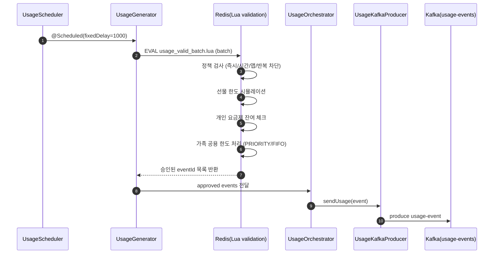
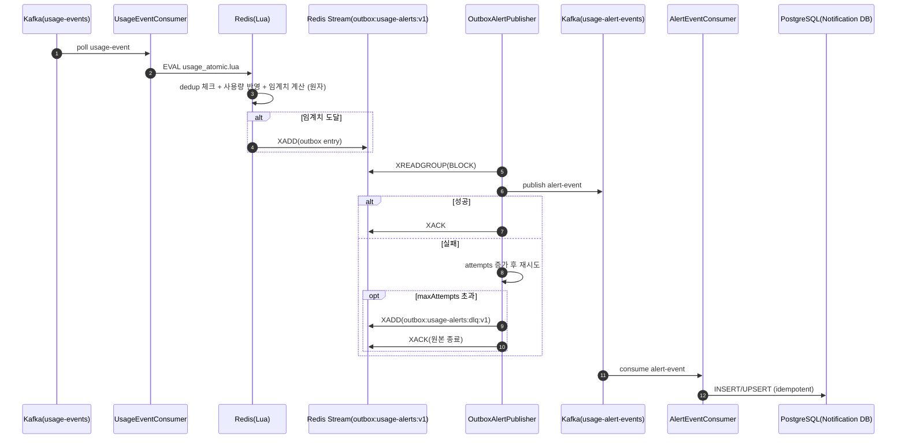
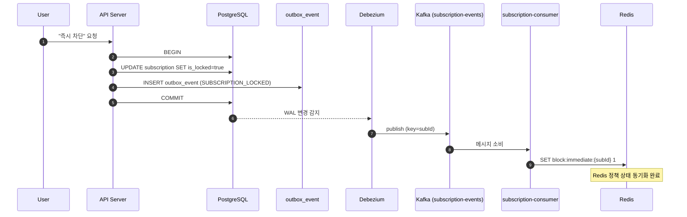
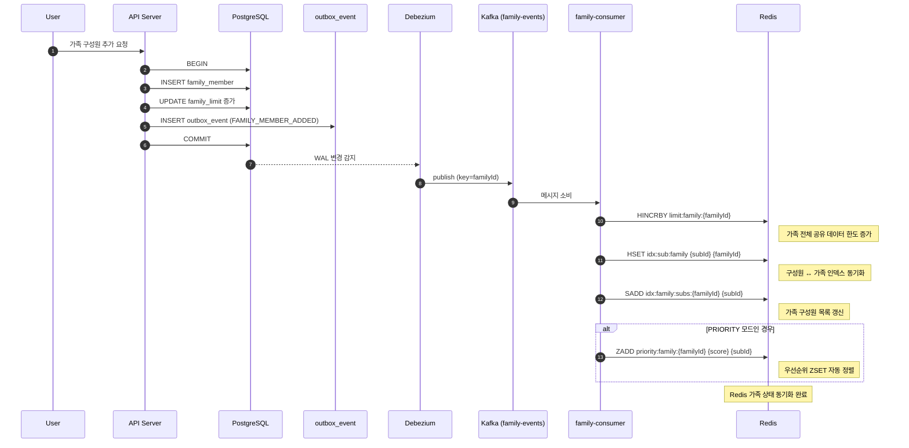
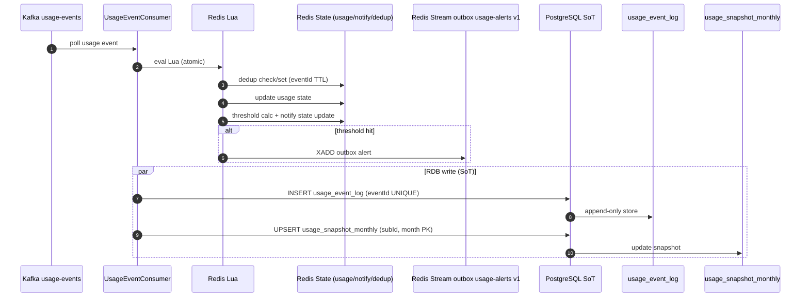
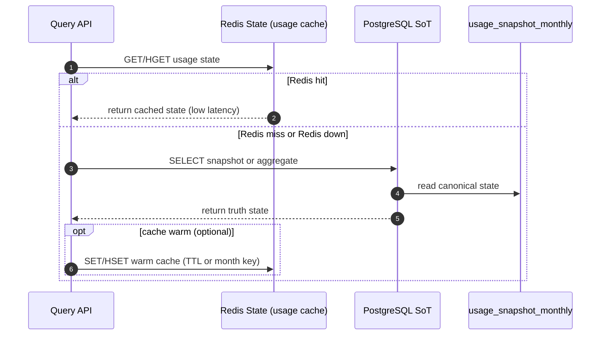
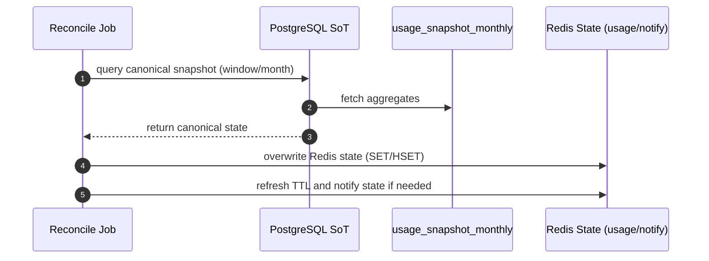

<h1 align="center">HotSpot 🔥</h1>
<p align="center">
  <b>공유는 여기서, 차단은 저기서? NO!!</b>
</p>
<p align="center"><b>가족 데이터 공유 + 사용 제어, 흩어진 기능을 하나의 통합 서비스로</b></p>

---
</br>

## 🚀 HotSpot Worker: 사용량 이벤트 발행 (Producer)

실시간 사용량 집계 파이프라인은 **usage-events가 Kafka에 적재되는 시점**부터 시작됩니다.

하지만 이 이벤트는 **단순히 랜덤으로 발행되는 것이 아니라, 정책 검증과 한도 시뮬레이션을 통과한 이벤트만 발행되도록 설계**되어 있습니다.

</br>

## 🗺️ 개요

### 1) 문제
실시간 이벤트 환경에서는 **정책과 한도**가 고정되어 있지 않습니다.
- **부모가 앱 차단을 설정하는 순간**
- **가족 공용 데이터 한도를 변경하는 순간**
- **선물 데이터가 추가/회수되는 순간**

이 모든 변경은 **이벤트 생성 시점과 처리 시점 사이**에 발생할 수 있습니다.

특히 다음과 같은 문제가 존재합니다.
- Producer에서 정책/한도 검증 없이 무조건 Kafka에 적재할 경우
→ 불필요한 이벤트가 대량으로 Consumer까지 전달됨

- Producer에서 검증했더라도, Kafka 적재 이후 정책/한도가 변경될 경우
→ Consumer가 이를 재검증하지 않을 경우 잘못된 사용 반영 발생

즉, **이벤트 생성 시점과 상태 반영 시점 사이의 시간차**가 정합성 리스크의 근본 원인입니다.

### 2) 해결
HotSpot은 이를 다음과 같이 설계했습니다.

**1차 방어: Producer 단계 정책/한도 검증**
- Redis Lua로 정책/차단/한도 시뮬레이션 수행
- 사용 불가 이벤트는 Kafka에 적재하지 않음
- 불필요한 이벤트를 사전에 차단하여 스트림 정제
- Kafka 부하 감소 및 다운스트림 오염 방지

Producer는 **정책 게이트 역할**을 수행합니다.


**2차 방어: Consumer 단계 원자적 재검증**
Consumer에서는 usage_atomic.lua를 통해:
	•	dedup 체크
	•	실제 사용량 반영
	•	임계치 계산
	•	알림 Outbox 적재

이 모든 과정을 **Redis Lua 원자 연산**으로 처리하여 
**정책/한도 변경이 Producer 이후 발생하더라도 Consumer에서 실제 반영 시점의 최신 상태 기준으로 처리**

</br>

## 🔎 데이터 흐름: Scheduler → Redis Lua 검증 → Kafka usage-events 발행


### 흐름 상세

#### Step 0. Scheduler 기반 이벤트 생성
- @Scheduled(fixedDelay=1000)로 1초마다 이벤트 생성
- Redis에 등록된 가족/구성원(subId)을 기준으로 랜덤 사용량 생성
- 대량 이벤트 상황(부하/스트리밍 환경)을 가정한 구조

</br>

#### Step 1. Redis Lua 기반 배치 정책 검증

데이터 사용량 이벤트를 생성하여 Kafka로 바로 보내지 않습니다.
Redis Lua Script를 활용하여 "이 사용자가 현재 데이터를 쓸 수 있는 사용자인지"를 먼저 검증한 후 이를 통과한 사용자들에 대해서만 Kafka로 이벤트를 발행합니다.

- **정책 차단 검사**
	•	즉시 차단 (block:immediate)
	•	시간 차단 (block:time)
	•	앱 차단 (block:app)
	•	반복 차단 (block:repeat)

- **선물 데이터 소진 시뮬레이션**
	•	idx:gift:* 정렬 기준으로 선물 순서 보장
	•	남은 gift_limit 계산
	•	메모리 캐시 기반 차감 시뮬레이션

- **개인 요금제 데이터 잔여 체크**
	•	limit:sub
	•	usage:sub:{yyyyMM}
	•	남은 개인 한도 계산

- **가족 공용 데이터 한도 처리**
	•	priority:family:{familyId} 존재 여부에 따라 **우선순위 처리 모드 OR 선착순 모드**
	•	가족 전체 한도 + 가족 공용 데이터 구성원 개별 한도 동시 체크

</br>

#### Step 2. 승인된 이벤트만 Kafka로 발행
- Redis Lua가 반환한 **승인된 eventId만 필터링하여 Kafka usage-events Topic**에 적재합니다.
- **정책 검증 위반 이벤트나 잔여 한도 초과 이벤트**는 Topic에 적재되지 않습니다.

</br>

---

</br>


## 🚚 HotSpot Worker: 사용량 집계 & 알림 파이프라인

Spring Boot + Kafka + Redis + PostgreSQL 기반의 **실시간 데이터 사용량 집계 및 임계치 알림 파이프라인**입니다.  
핵심은 이벤트를 소비할 때 **Redis Lua로 사용량 반영 + 임계치 계산 + 알림 Outbox 적재를 원자적으로 처리**하고, 
별도 Publisher가 Outbox를 읽어 **Kafka로 발행**한 뒤 알림 서비스를 통해 **Notification DB(PostgreSQL)** 에 적재하는 구조입니다.

</br>

## 🗺️ 개요

### 1) 문제
실시간 이벤트 처리에서는 다음 문제가 자주 발생합니다.

- 사용량 반영과 알림 생성이 분리되면 **불일치**가 발생(알림 누락/중복)
- Kafka 발행, DB 적재는 네트워크/브로커/DB 장애로 실패 가능
- 장애가 나도 운영자가 지금 어디가 막혔는지 즉시 판단해야 함

### 2) 해결
- `usage-events` 소비 시 **Redis Lua**로 다음을 **단일 원자 연산**으로 처리합니다.
  - dedup(중복 이벤트 방지)
  - 사용량 상태 반영
  - 임계치 계산
  - 알림 발생 시 Outbox Stream 적재
- `OutboxAlertPublisher`가 Outbox를 **Redis Stream consumer group**으로 읽어 **Kafka `usage-alert-events`** 발행
- 발행 성공 시 `XACK`, 실패 시 attempts 메타 증가 → `maxAttempts` 초과 시 **DLQ**로 격리
- 알림 컨슈머가 `usage-alert-events`를 소비하여 **Notification DB(PostgreSQL)** 적재

--- 
</br>

## 🔎 데이터 흐름: usage-events → Redis Lua → Outbox → Kafka → Notification DB



</br>

이 파이프라인은 **사용량 반영(상태 변경)** 과 **알림 발생(이벤트 생성)** 을 분리하지 않고, **Redis Lua로 원자적으로** 처리하는 것이 핵심입니다.  
그 다음 단계(Outbox → Kafka → DB)는 **외부 장애가 자주 나는 구간**이라 Outbox 기반으로 **재시도/복구 가능**하게 설계했습니다.

</br>

### 1) 이벤트 처리 단위와 정합성 기준

- 입력 이벤트(usage-events)는 `eventId`를 포함한다고 가정하며, 이 값은 **멱등의 기준**이 됩니다.
- 동일 이벤트가 Kafka에서 재전달되거나(리밸런스/재시작) 컨슈머가 재처리해도,
  `dedup:usage-event:{eventId}`를 통해 **사용량이 두 번 반영되지 않도록** 보장합니다.
- 사용량 상태와 알림 생성은 같은 시점의 결과여야 하므로, Lua에서 **상태 업데이트 + 임계치 판정 + Outbox 적재**를 **하나의 트랜잭션(원자 연산)** 처럼 실행합니다.

</br>

### 2) 흐름 상세

#### Step 0. Kafka에서 usage-events 소비
- UsageConsumer가 사용량 이벤트를 소비합니다.

</br>

#### Step 1. Redis Lua 실행 (원자 처리)
Kafka에서 받은 이벤트를 Lua로 전달해 다음을 한 번에 처리합니다.

(1) **Dedup 체크**
- `dedup:usage-event:{eventId}`가 이미 있으면 **바로 종료(dedup_hit)**  
- 없으면 set + TTL 설정 후 다음 단계 진행

(2) **사용량 반영**
- `usage:*` 키에 사용자/가족 사용량을 반영하고 잔여량을 갱신합니다.
- 이 업데이트가 “정답”이 되므로 반드시 원자적으로 수행되어야 합니다.

(3) **임계치 계산**
- 갱신된 잔여량/소진률을 기준으로 50/30/10/0 같은 임계치를 판정합니다.
- 여기서 `notify:*` 상태를 활용해 **같은 임계치 알림이 중복 생성되지 않도록** 합니다.

(4) **알림 Outbox 적재**
- 임계치 도달(또는 정책 조건 충족) 시 Outbox Stream에 알림을 적재합니다.
- Outbox stream key는 고정: `outbox:usage-alerts:v1`

**결과적으로 Lua가 성공하면**
- 사용량 상태는 업데이트되었고
- 필요하면 Outbox에 알림이 반드시 들어가 있습니다.  
- 즉, **상태는 바뀌었는데 알림은 없다/알림은 있는데 상태가 안 바뀌었다**가 원천적으로 발생하지 않습니다.

</br>

#### Step 2. OutboxAlertPublisher가 Stream에서 읽어 Kafka로 발행
- `OutboxAlertPublisher`는 `outbox:usage-alerts:v1`를 **consumer group**으로 읽습니다.
- 발행 성공 시 `XACK`로 처리 완료 표시
- 발행 실패 시 attempts 메타를 증가시키며 재시도합니다.
- `maxAttempts` 초과 시 DLQ로 적재해 격리합니다.

</br>

#### Step 3. Notification Consumer가 DB에 적재
- `usage-alert-events`를 소비하여 Notification DB(PostgreSQL)에 적재합니다.
- 최소 1회 전달 구조이므로, DB는 `event_id`/`alert_id` 기준 UNIQUE 또는 UPSERT로 **멱등 삽입**을 보장해야 합니다.
</br>

--- 

</br>

## 🔄 RDB ↔ Redis 정합성 보장: CDC(Debezium + Outbox)
HotSpot은 PostgreSQL을 Source of Truth(SoT) 로 사용하고,
Redis는 정책/한도 판단을 위한 실시간 상태 레이어로 사용합니다.

따라서 두 저장소의 상태는 항상 동일해야 합니다.

## 🗺️ 개요

### 1) 문제
HotSpot에서 다음과 같은 변경은 모두 PostgreSQL에서 발생합니다.
- 즉시 차단 / 정책 적용
- 요금제 변경
- 가족 구성원 추가/삭제
- 선물 데이터 지급

이 변경은 **Postgres DB(Source DB)에 반영된 순간 Redis(Target DB)에도 즉시 반영**되어야 합니다.

우리는 이를 해결하기 위해 3가지 방식을 검토했습니다.

1. User Server가 Redis를 직접 업데이트

```
DB UPDATE → Redis UPDATE
```

**한계**
- DB 성공 후 Redis 실패 가능 → 정합성 깨짐
- Redis 성공 후 DB 롤백 가능 → 잘못된 상태 유지
- 여러 Redis Key 동시 수정 시 부분 성공 위험
- 장애 복구 로직 복잡

> RDB와 Redis 사이의 원자성을 보장할 수 없음

2. User Server가 Kafka 이벤트를 직접 발행

```
DB UPDATE → Kafka 발행 → Consumer → Redis 반영
```

**한계**
- DB는 성공했지만 Kafka 발행 실패 가능
- Kafka 발행 성공 후 DB 롤백 가능
- 재시도/멱등성/순서 보장을 애플리케이션에서 직접 구현해야 함

> DB 변경과 메시지 발행 사이에 분산 트랜잭션 문제가 발생


#### 이 한계점들을 통합적으로 해결하기 위해 저희는 최종적으로 CDC(Debezium) + Outbox 패턴을 도입했습니다

**핵심 전략**
- DB 변경 + outbox_event INSERT를 하나의 트랜잭션으로 묶는다
- Debezium이 WAL(Logical Replication)을 통해 커밋된 변경만 감지한다
- Kafka Topic으로 자동 발행한다
- Consumer가 Redis 상태를 동기화한다

**결과적으로 커밋된 DB 상태만 Redis에 반영되는 구조가 됩니다.**

> 정합성 문제를 애플리케이션 코드에서 보정하는 대신, 데이터베이스 로그 레벨에서 구조적으로 해결한 설계입니다.

## 🔎 동작 흐름

### 예시 1 — 회선 데이터 사용 즉시 차단 상황


> DB 변경과 이벤트 기록이 하나의 트랜잭션으로 묶이므로 Commit 성공 시에만 Redis가 변경됩니다


### 예시 2 — 가족 결합에 구성원이 추가된 상황


> 여러 Redis Key를 동시에 업데이트해야 하는 구조에서도 CDC 기반 이벤트 처리를 통해 정합성을 유지합니다.


## 🔁 Redis-only의 한계와 RDB 기반 정합성 아키텍처 전환

1차 MVP에서는 **Redis 단독**으로 사용량 반영/정책 판정/알림 Outbox까지 처리해 기능을 완성했습니다.  
다만 Redis-only 구조는 운영 단계에서 아래 2가지 리스크가 본질적으로 남습니다.

</br>

---

</br>

### ⚠️ Redis-only의 구조적 한계

#### 1) 안정성(내구성) 리스크
- Redis 장애/재시작/데이터 유실 시  
  **사용량 상태 자체가 사라질 수 있음**
- Outbox/중복 방지/임계치 상태도 Redis에만 있으면  
  장애가 곧 **알림 누락/중복**으로 이어질 수 있음

#### 2) 정합성(Consistency) 리스크
- 이벤트 재처리, 동시성 경합, 운영 중 키 손상/부분 유실 등의 이유로  
  Redis 상태가 정답이라는 보장을 유지하기 어려움
- Redis는 빠르지만 **감사·정산·장기 보관**의 근본 저장소로는 부적합

</br>

## 🎯 목표: RDB를 진실의 근원으로, Redis는 빠른 연산/조회 레이어로

PostgreSQL을 **SoT(Source of Truth)** 로 두고,
Redis는 다음 역할에 집중합니다.

- **실시간 연산/판정(저지연)**: Lua 기반 원자 업데이트, 임계치 계산, Outbox 적재
- **빠른 조회(캐시/대시보드)**: 가족/구성원 잔여량, 최근 사용량, 임계치 상태 등
- **Fallback**: Redis miss/장애 시 RDB 조회로 서비스 연속성 확보

핵심 전략은 아래 3가지입니다.

1. **Dual-Write(이중 기록)**: 처리 결과를 Redis와 RDB 모두에 기록  
2. **Reconciliation(정합성 맞춤)**: RDB를 기준으로 Redis를 주기적으로 덮어씀 
3. **Read Fallback**: Redis miss 시 RDB로 조회 후 캐시 워밍

---
</br>

## 🔎 데이터 흐름: Write Path / Read Path / Reconcile Path

### 1) Write Path (실시간 처리)



`usage-events` 소비 시, Redis Lua로 원자 처리 후 RDB에도 반영합니다.

- **Redis**
  - 빠른 잔여량 갱신
  - 임계치 계산
  - OutBox 적재
- **RDB**
  - **원본 이벤트(append-only)** 저장
  - **월 스냅샷** 저장

**설계 의도**  
- Redis는 실시간 판정/조회를 위해 사용  
- RDB는 감사/복구/정산/재생성을 위해 사용  
- 원본 이벤트를 남겨야 Redis 오류/버그가 결과에 섞여도 대응 가능

</br>

### 2) Read Path (조회)



조회는 기본적으로 Redis를 먼저 보고, miss 또는 Redis 장애 시 RDB로 fallback합니다.

(1) **Redis hit**
  - 즉시 응답(저지연)

(2) **Redis miss / 장애**
   - RDB 조회 → 응답

</br>

### 3) Reconcile Path (정합성 교정)



Redis와 RDB 사이의 불일치를 제거하기 위해 **주기적으로 RDB 기준으로 Redis를 덮어씁니다.**

- 주기: 운영이 허용하는 기준으로 설정
- 대상: `usage:*`, `notify:*` 등 조회/판정에 영향을 주는 핵심 상태
- 방식: RDB 스냅샷/집계 결과를 Redis에 overwrite + 필요 시 만료 갱신

**설계 의도**  
- Redis는 빠르지만 진실은 아니다.  
- drift는 발생한다는 전제를 두고, drift를 **주기적으로 제거**한다.

---
</br>
